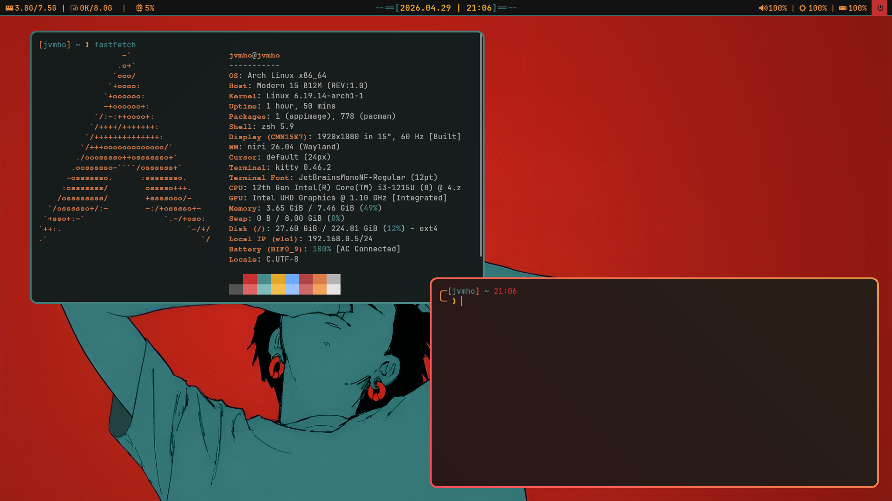

# 🏠 Dotfiles

Personal Linux desktop configuration managed with **GNU Stow**.  
Featuring a dual-compositor setup (**Hyprland** & **Niri**) on Wayland, with a focus on minimalism, performance, and keyboard-driven workflows.



## 📖 Overview

This repository contains my personal configuration files for Wayland compositors, terminal, shell, and UI components. All dotfiles are organized as Stow packages, making deployment, syncing, and rollback trivial across machines.

## 📦 Software Stack

| Component   | Description                                      |
| :---------- | :----------------------------------------------- |
| **Hyprland** | Dynamic tiling Wayland compositor                |
| **Niri**     | Scrollable tiling Wayland compositor             |
| **Hyprlock** | Very customizable lock screen                    |
| **Waybar**   | Highly customizable status bar                   |
| **Wofi**     | Wayland application launcher & menu              |
| **Kitty**    | GPU-accelerated, feature-rich terminal emulator  |
| **Fastfetch**| Utility to flex with your distro >:)             |
| **Zsh**      | Interactive shell with custom prompt & aliases   |
| **Tools**    | `grim`, `slurp`, `wl-clipboard`, `playerctl`, `brightnessctl`, `pamixer`, `aww`, `nmcli` |

## 🎨 Aesthetics

- **Style:** Niri-inspired UI within Hyprland.
- **Color Palette:** Warm red (`#FF4F5B`) to orange (`#E69143`) active gradients; Dark teal inactive borders. Based on the [Ashen](https://github.com/ficd0/ashen) theme.
- **Geometry:** 12px corner rounding, and 10px gaps.
- **Terminal/UI Font:** `JetBrainsMono Nerd Font`

## 🛠️ Installation

### 1. Install Dependencies (Arch-based)

```bash
sudo pacman -S --needed \
  hyprland niri waybar wofi kitty zsh stow git \
  ttf-jetbrains-mono-nerd noto-fonts-emoji \
  grim slurp wl-clipboard playerctl brightnessctl pamixer polkit-gnome
```

> 💡 For Debian/Ubuntu/Fedora, adapt package names accordingly. Some tools may require AUR or third-party repos.

### 2. Clone & Deploy

```bash
git clone https://github.com/YOUR_USERNAME/dotfiles.git ~/dotfiles
cd ~/dotfiles

# Deploy all packages
stow */

# Or deploy selectively
stow hyprland niri waybar wofi kitty zsh
```

### 3. Set Zsh as Default Shell

```bash
chsh -s $(which zsh)
# Log out and back in for changes to take effect
```

## ⌨️ Keybindings

Super = Windows/Command key

### 🪟 Window & Workspace Management

Binding	Action
- `Super + Q`	Open Terminal (Kitty)
- `Super + Shift + C`	Close focused window
- `Super + Space`	Launch App Menu (Wofi)
- `Super + H/J/K/L`	Focus window (Vim-style Left/Down/Up/Right)
- `Super + Ctrl + H/J/K/L`	Move window (Vim-style)
- `Super + O`	Toggle Overview (niri only)
- `Super + V`	Toggle floating mode
- `Super + F`	Maximize window (keep bars)
- `Super + Shift + F`	True Fullscreen
- `Super + 1..9`	Switch to workspace 1-9
- `Super + R`	Toggle Split (Dwindle)

### 🚀 Apps & Utilities

Binding	Action
- `Super + Z`	Launch Zen Browser
- `Super + Shift + S`	Screenshot region
- `Super + Shift + Space`	Power Menu
- `Super + Shift + E`	Logout Script
- `Super + Alt + L`	Lock Screen (Hyprlock)
- `Super + S`	Toggle Special Workspace (Scratchpad)
- `Super + Shift + W` WiFi Connection Manager

### 🔊 Media & Brightness

Binding	Action
- `XF86AudioRaise/Lower`	Volume +/- 10%
- `XF86AudioMute`	Toggle Mute
- `XF86MonBrightnessUp/Down`	Brightness +/- 10%

> ⚠️ Niri uses a different config syntax (config.kdl). Keybinds are functionally similar but defined separately in niri/.config/niri/.

## 📂 Repository Structure

```
dotfiles/
├── hyprland/          → ~/.config/hypr/
├── niri/              → ~/.config/niri/
├── waybar/            → ~/.config/waybar/
├── wofi/              → ~/.config/wofi/
├── kitty/             → ~/.config/kitty/
├── zsh/               → ~/.zshrc, ~/.zsh_prompt
├── .stow-local-ignore # Files/dirs Stow should ignore
└── README.md
```

Stow automatically creates symlinks from ~/dotfiles/<package>/ to your $HOME. No files are copied.

## 🔧 Stow Cheat Sheet
Command	Description
- `stow <package>`	Create symlinks for a package
- `stow -D <package>`	Remove symlinks (unstow)
- `stow -R <package>`	Restow (useful after moving/renaming files)
- `stow --adopt <package>`	Import existing dotfiles into the repo
- `stow -n -v <package>`	Dry-run: preview what Stow will do
- `stow */`	Deploy all packages in the repo

> 💡 After --adopt, always run git diff before committing to avoid overwriting repo files unintentionally.

## 🙏 Credits

- [Hyprland](https://github.com/hyprwm/Hyprland) & [Niri](https://github.com/niri-wm/niri) – for pushing Wayland tiling forward
- [Waybar](https://github.com/Alexays/Waybar) & [Wofi](https://github.com/SimplyCEO/wofi) – for sleek Wayland UI tools
- [Kitty](https://github.com/kovidgoyal/kitty) – for a blazing fast terminal
- [ficd0](https://github.com/ficd0) - for beautiful color palette from his helix [ashen](https://github.com/ficd0/ashen) theme
- [krisfur](https://github.com/krisfur/cachyos-setup/tree/main) - for his fastfetch theme
- The Linux ricing community – for endless inspiration & shared configs

## 📜 License

This repository is licensed under the MIT License.
Feel free to fork, adapt, and steal ideas. A ⭐ is appreciated if you find it useful!

Managed with ❤️ and GNU stow
